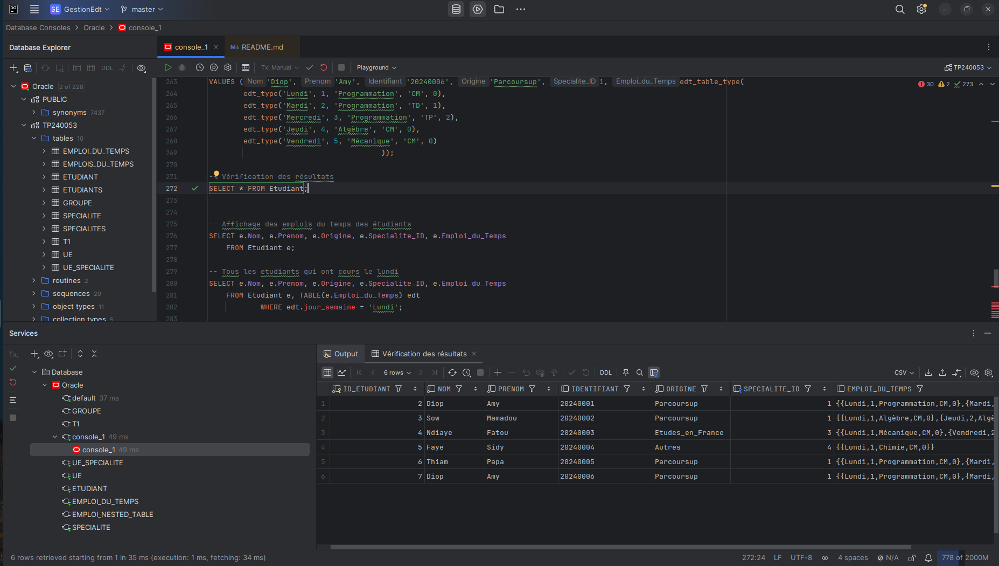

# TP2_BDD - Gestion des étudiants et des emplois du temps
--- 
Projet de Bases de Données - `THIAM PAPA`
---

## Description

Le projet **TP2_BDD** est un exercice pratique dans le cadre du cours de bases de données. Il a pour objectif la modélisation et la gestion d'un système de gestion des étudiants, des unités d'enseignement (UE), des groupes de travaux dirigés (TD) et pratiques (TP), ainsi que la gestion des emplois du temps. Le projet s'appuie sur des concepts de **modélisation relationnelle-objet** en utilisant des types d'objets dans SQL.

## Fonctionnalités

- Gestion des étudiants (création, modification, suppression)
- Gestion des Unités d'Enseignement (UE)
- Gestion des groupes TD et TP
- Attribution des spécialités aux étudiants
- Création et gestion des emplois du temps
- Utilisation de types SQL personnalisés (types objet) pour modéliser les concepts

## Structure de la base de données

Le projet repose sur plusieurs tables et types d'objets qui modélisent les différentes entités :

- **Fonctionnalités**

  - Gestion des étudiants (création, modification, suppression)
  - Gestion des Unités d'Enseignement (UE)
  - Gestion des groupes TD et TP
  - Attribution des spécialités aux étudiants
  - Création et gestion des emplois du temps
  - Utilisation de types SQL personnalisés (types objets)
  

- **Tables** :
  1. `UE` : Gestion des Unités d'Enseignement (nom, cours, enseignant)
  2. `Specialite` : Gestion des spécialités des étudiants
  3. `Groupe_TD` et `Groupe_TP` : Groupes de TD et TP associés aux UE
  4. `UE_Specialite` : Lien entre UE et spécialité
  5. `Emploi_du_Temps` : Gestion des emplois du temps des étudiants
  6. `Etudiant` : Gestion des informations des étudiants (nom, prénom, spécialité, emploi du temps)

- **Types SQL personnalisés** :
  - `specialite_type` : Représente une spécialité académique.
  - `edt_type` : Représente un créneau horaire pour l'emploi du temps.
  - `etudiant_type` : Représente un étudiant avec son emploi du temps et sa spécialité.
  - `edt_table_type` : Représente une collection des créneaux horaires (emploi du temps).

## Installation

1. **Prérequis** :
    - Un serveur de base de données compatible avec les types SQL (Oracle, PostgreSQL).
    - Accès à un environnement SQL (comme SQL Developer ou pgAdmin).

2. **Étapes d'installation** :
    - Clonez le dépôt Git :
      ```bash
      git clone https://www-apps.univ-lehavre.fr/forge/tp240053/tp2_bdd.git
      cd tp2_bdd
      ```
    - Ouvrez le fichier SQL dans votre environnement SQL et exécutez-le pour créer la structure de la base de données.

3. **Exécution du script SQL** :
    - Exécutez le script SQL pour créer les types, tables et contraintes dans votre base de données :
      ```sql
      @path/to/your_script.sql
      ```

## Utilisation

Une fois la base de données installée, vous pouvez interagir avec elle via des requêtes SQL pour :

- Ajouter des étudiants dans la table `Etudiant`
- Gérer les emplois du temps dans `Emploi_du_Temps`
- Assigner des groupes TD et TP aux étudiants dans `Groupe_TD` et `Groupe_TP`
- Lier des spécialités aux UE dans `UE_Specialite`

### DataGrip - Interface graphique


## Exemple Table Etudiant
| id_etudiant | nom | prenom | origine | specialite_id | Emploi_du_Temps                                                                                 | Groupe |
| --- | --- | --- | --- | --- |-------------------------------------------------------------------------------------------------| --- |
| 1 | THIAM | Papa | Parcoursup | 1 | {{Lundi,1,Programmation,CM,0},{Mardi,2,Programmation,TD,1},{Mercredi,3,Programmation,TP,2}} ... | 1 |
| 2 | DIALLO | Mamadou | Parcoursup | 2 | {{Lundi,1,Algèbre,CM,0},{Jeudi,2,Algèbre,TD,5} ... }                                            | 2 |


**Auteur** : `Papa THIAM` - Étudiant M1 Informatique à l'Université du Havre
